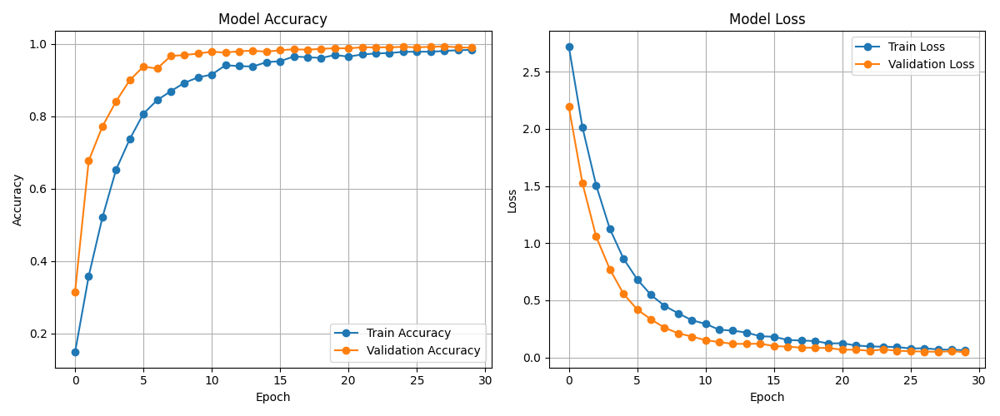

.# 🤟 Sign Language to Speech Translator 🗣️  
Translate sign language gestures (using both hands) into real-time speech using computer vision and deep learning.

Built with ❤️ using **TensorFlow**, **MediaPipe**, **OpenCV**, and **pyttsx3**.

---

## 📁 Project Structure

```
SIGN_LANGUAGE_TO_SPEECH/
├── accuracy/
│   ├── accuracy_loss.png           # Training performance graph
│   ├── test.txt                    # List/log of test samples
│   └── train.txt                   # List/log of training samples
├── data/
│   └── gesture_landmarks_both_hands.csv  # Collected landmarks dataset
├── model/
│   ├── gesture_dl_model.keras     # Trained gesture recognition model
│   └── label_encoder.pkl          # Encoded gesture labels
├── total_signs/
│   ├── display_signs.py           # Display supported gestures
│   └── toal_signs.txt             # All gesture labels list
├── app.py                         # Real-time sign-to-speech translator
├── collect_data.py                # Gesture data collection script
├── train_dl_model.py              # Model training script
├── LICENSE                        # Project license
└── README.md                      # Project documentation
```

---

## 🚀 Project Overview

This system enables real-time **gesture-based communication** by recognizing sign language gestures and converting them into **spoken English** using speech synthesis.  
It’s ideal for:
- People with speech/hearing impairments
- Human-computer interaction (HCI)
- Educational demos and assistive tech

---

## 🔧 Setup & Requirements

Install all required libraries:

```bash
pip install tensorflow mediapipe opencv-python numpy pandas matplotlib pyttsx3 scikit-learn
```

---

## 🎯 How to Use

### 1️⃣ Collect Gesture Data

```bash
python collect_data.py
```
- Input the gesture label (e.g., "hello", "thank you").
- Perform the gesture in front of the webcam.
- The script captures 3D landmark data of both hands.

### 2️⃣ Train the Model

```bash
python train_dl_model.py
```
- Trains a Dense Neural Network on the collected gestures.
- Saves model (`gesture_dl_model.keras`) and encoder (`label_encoder.pkl`).
- Also visualizes training loss and accuracy.

### 3️⃣ Run Real-time Translator

```bash
python app.py
```
- Detects both hands using MediaPipe.
- Captures movement for 2 seconds once hands are detected.
- Predicts the most likely gesture.
- Uses `pyttsx3` to speak out the recognized sign.

---

## 📊 Model Performance

The graph below shows accuracy and loss trends during training:



---

## 📝 Adding New Gestures

1. Collect new gesture samples using `collect_data.py`.
2. Append the new data to `gesture_landmarks_both_hands.csv`.
3. Retrain the model with `train_dl_model.py`.
4. Update `toal_signs.txt` with new labels.

---

## 📦 Files to Note

| File | Description |
|------|-------------|
| `app.py` | Real-time webcam-based gesture recognition & speech |
| `collect_data.py` | Capture hand gesture data samples |
| `train_dl_model.py` | Train and evaluate gesture classification model |
| `model/` | Stores the saved DL model & label encoder |
| `data/` | Stores collected gesture data (CSV format) |

---

## 💡 Future Improvements

- Add support for continuous sentence-level translation  
- Integrate sign-to-text + text-to-speech pipelines  
- Build a user-friendly desktop or mobile interface  
- Add more sign languages (BSL, ISL, etc.)

---

## 👨‍💻 Author

**Divya Khunt**  
B.Tech in Engineering | ML & Deep Learning Enthusiast  
[GitHub Profile](#)

---

## 📄 License

This project is licensed under the [MIT License](LICENSE).

---

## 🌟 Show Some Love

If you found this project helpful:
- ⭐ Star the repo
- 🧠 Share it with friends
- 🔁 Fork it and build on top of it!
